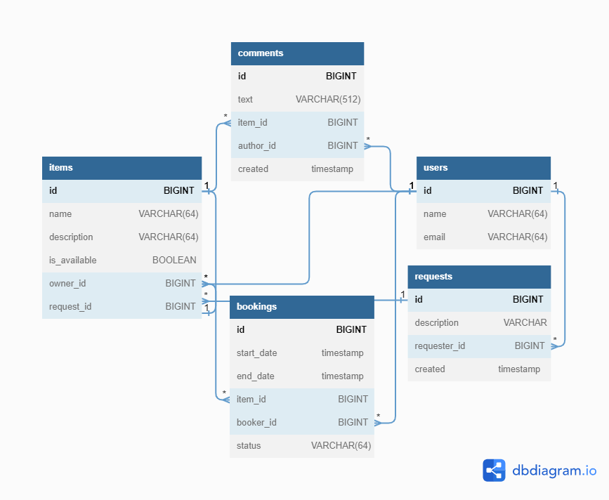

# Проект `ShareIt`.
## Спринт №13
<details> <summary> Техническое задание. Часть 1 </summary>  

В этом модуле вы будете создавать сервис для шеринга (от англ. _**share**_ — «делиться») вещей.
Шеринг как экономика совместного использования набирает сейчас всё большую полярность.
Если в 2014 году глобальный рынок шеринга оценивался всего в $15 млрд, то к 2025 может достигнуть $335 млрд.

Почему шеринг так популярен. Представьте, что на воскресной ярмарке вы купили несколько картин и
хотите повесить их дома. Но вот незадача — для этого нужна дрель, а её у вас нет. Можно, конечно,
пойти в магазин и купить, но в такой покупке мало смысла — после того, как вы повесите картины,
дрель будет просто пылиться в шкафу. Можно пригласить мастера — но за его услуги придётся заплатить.
И тут вы вспоминаете, что видели дрель у друга. Сама собой напрашивается идея — одолжить её.

Большая удача, что у вас оказался друг с дрелью и вы сразу вспомнили про него!
А не то в поисках инструмента пришлось бы писать всем друзьям и знакомым.
Или вернуться к первым двум вариантам — покупке дрели или найму мастера.
Насколько было бы удобнее, если бы под рукой был сервис, где пользователи делятся вещами!
Созданием такого проекта вы и займётесь.
## Что должен уметь новый сервис
Ваш проект будет называться ShareIt. Он должен обеспечить пользователям, во-первых,
возможность рассказывать, какими вещами они готовы поделиться, а во-вторых, находить нужную вещь
и брать её в аренду на какое-то время.

Сервис должен не только позволять бронировать вещь на определённые даты, но и
закрывать к ней доступ на время бронирования от других желающих.
На случай, если нужной вещи на сервисе нет, у пользователей должна быть возможность оставлять запросы.
Вдруг древний граммофон, который странно даже предлагать к аренде, неожиданно понадобится
для театральной постановки. По запросу можно будет добавлять новые вещи для шеринга.

## Каркас приложения
В этом спринте от вас требуется создать каркас приложения, а также разработать часть его веб-слоя.
Основная сущность сервиса, вокруг которой будет строиться вся дальнейшая работа, — вещь.
В коде она будет фигурировать как `Item`.

Пользователь, который добавляет в приложение новую вещь, будет считаться ее владельцем.
При добавлении вещи должна быть возможность указать её краткое название и добавить небольшое описание.
К примеру, название может быть — `«Дрель “Салют”»`, а описание — `«Мощность 600 вт, работает ударный режим,
так что бетон возьмёт»`. Также у вещи обязательно должен быть статус — доступна ли она для аренды.
Статус должен проставлять владелец.

Для поиска вещей должен быть организован поиск. Чтобы воспользоваться нужной вещью,
её требуется забронировать. Бронирование, или `Booking` — ещё одна важная сущность приложения.
Бронируется вещь всегда на определённые даты. Владелец вещи обязательно должен подтвердить
бронирование.

После того как вещь возвращена, у пользователя, который её арендовал, должна быть возможность оставить отзыв.
В отзыве можно поблагодарить владельца вещи и подтвердить, что задача выполнена — дрель успешно
справилась с бетоном, и картины повешены.

Ещё одна сущность, которая вам понадобится, — запрос вещи `ItemRequest`.
Пользователь создаёт запрос, если нужная ему вещь не найдена при поиске.
В запросе указывается, что именно он ищет. В ответ на запрос другие пользовали могут добавить нужную вещь.

У вас уже готов шаблон проекта с использованием Spring Boot. Создайте ветку `add-controllers` и
переключитесь на неё — в этой ветке будет вестись вся разработка для первого спринта.

## Реализация модели данных
В этом модуле вы будете использовать структуру не по типам классов, а по
фичам (англ. _**Feature layout**_) — весь код для работы с определённой сущностью должен быть
в одном пакете. Поэтому сразу создайте четыре пакета — `item`, `booking`, `request` и `user`.
В каждом из этих пакетов будут свои контроллеры, сервисы, репозитории и другие классы,
которые вам понадобятся в ходе разработки. В пакете `item` создайте класс `Item`.

## Создание DTO-объектов и мапперов
Созданные объекты `Item` и `User` вы в дальнейшем будете использовать для работы с базой
данных (это ждёт вас в следующем спринте). Сейчас, помимо них, вам также понадобятся объекты,
которые вы будете возвращать пользователям через REST-интерфейс в ответ на их запросы.

Разделять объекты, которые хранятся в базе данных и которые возвращаются пользователям, — хорошая
практика. Например, вы можете не захотеть показывать пользователям владельца вещи (поле `owner`),
а вместо этого возвращать только информацию о том, сколько раз вещь была в аренде.
Чтобы это реализовать, нужно создать отдельную версию каждого класса, с которой будут работать
пользователи, — DTO (_**D**ata **T**ransfer **O**bject_).

Кроме DTO-классов, понадобятся Mapper-классы — они помогут преобразовывать объекты модели
в DTO-объекты и обратно. Для базовых сущностей `Item` и `User` создайте Mapper-класс и метод
преобразования объекта модели в DTO-объект.

## Разработка контроллеров
Когда классы для хранения данных будут готовы, DTO и мапперы написаны, можно перейти
к реализации логики. В приложении будет три классических слоя — контроллеры, сервисы
и репозитории. В этом спринте вы будете работать преимущественно с контроллерами.

Для начала научите ваше приложение работать с пользователями. Ранее вы уже создавали
контроллеры для управления пользователями — создания, редактирования и просмотра.
Здесь вам нужно сделать то же самое. Создайте класс `UserController` и методы в нём
для основных CRUD-операций. Также реализуйте сохранение данных о пользователях в памяти.

Далее переходите к основной функциональности этого спринта — работе с вещами.
Вам нужно реализовать добавление новых вещей, их редактирование, просмотр списка вещей и поиск.
Создайте класс `ItemController`. В нём будет сосредоточен весь REST-интерфейс для работы с вещью.

Вот основные сценарии, которые должно поддерживать приложение.
* Добавление новой вещи. Будет происходить по эндпойнту `POST /items`. На вход поступает объект `ItemDto`.
  `userId` в заголовке `X-Sharer-User-Id` — это идентификатор пользователя, который добавляет вещь.
  Именно этот пользователь — владелец вещи. Идентификатор владельца будет поступать на вход
  в каждом из запросов, рассмотренных далее.
* Редактирование вещи. Эндпойнт `PATCH /items/{itemId}`. Изменить можно название, описание и
  статус доступа к аренде. Редактировать вещь может только её владелец.
* Просмотр информации о конкретной вещи по её идентификатору. Эндпойнт `GET /items/{itemId}`.
  Информацию о вещи может просмотреть любой пользователь.
* Просмотр владельцем списка всех его вещей с указанием названия и описания для каждой.
  Эндпойнт `GET /items`.
* Поиск вещи потенциальным арендатором. Пользователь передаёт в строке запроса текст, и система
  ищет вещи, содержащие этот текст в названии или описании. Происходит по
  эндпойнту /items/search?text={text}, в `text` передаётся текст для поиска.
  Проверьте, что поиск возвращает только доступные для аренды вещи.

Для каждого из данных сценариев создайте соответственный метод в контроллере. Также создайте
интерфейс `ItemService` и реализующий его класс `ItemServiceImpl`, к которому будет обращаться
ваш контроллер. В качестве DAO создайте реализации, которые будут хранить данные в памяти приложения.
Работу с базой данных вы реализуете в следующем спринте.

## Тестирование
Для проверки кода мы подготовили
[Postman-коллекцию](https://github.com/yandex-praktikum/java-shareit/blob/add-controllers/postman/sprint.json).
С её помощью можно протестировать ваше API и убедиться, что все запросы успешно выполняются.
## Дополнительные советы ментора
Если задание показалось вам недостаточно подробным, вы можете обратиться к этому файлу:
[Дополнительные советы ментора](https://code.s3.yandex.net/Java/4mod1sprProject/mentors_advice_1.2.pdf).

В нём вы найдёте дополнительную информацию о том, как выполнить задание спринта. Но помните:
реальные ТЗ часто скупы на подробности, поэтому разработчику приходится самостоятельно принимать
некоторые архитектурные решения. Чем раньше вы научитесь определять минимальные требования,
необходимые для начала разработки проекта, тем проще вам будет работать в команде над реальным
проектом.

На этом пока всё! Но и это немало для хорошего старта! Удачного программирования!
</details>  

### Commits:  
#### Commit №13.1:  
feat:  
-Создан пакет booking, содержащий файлы классов BookingDto, BookingMapper, Booking и BookingController;  
-Создан пакет item, содержащий файлы классов ItemDto, ItemMapper, Item, ItemRepositoryImpl, ItemService, ItemController и файл интерфейса ItemRepository;  
-Создан пакет request, содержащий файлы классов ItemRequestDto, ItemRequestMapper, ItemRequest и ItemRequestController;  
-Создан пакет user, содержащий файлы классов UserDto, UserMapper, User, UserRepositoryImpl и файл интерфейса UserRepository;  
-Создан пакет exception, содержащий файлы классов ItemNotFoundException, UserAlreadyExistsException, UserNotFoundException и ValidationException;  
-Создан пакет handler, содержащий файл класса ErrorHandler.  

#### Commit №13.2:  
refactor:  
-исключения UserNotFoundException и ItemNotFoundException объеденины в одно;  
-переработан класс BookingDto;  
-переработан класс BookingMapper;  
-переработан класс ErrorHandler;  
-переработан класс ItemDto;  
-переработан класс ItemMapper;  
-переработан класс Item;  
-переработан интерфейс ItemRepository;  
-переработан класс ItemRepositoryImpl;  
-переработан класс ItemService;  
-переработан класс ItemController;  
-переработан класс ItemRequestDto;  
-переработан класс ItemRequestMapper;  
-переработан класс ItemRequest;  
-переработан класс UserDto;  
-переработан класс UserMapper;  
-переработан класс User;  
-переработан интерфейс UserRepository;  
-переработан класс UserRepositoryImpl;  
-переработан класс UserService.  

#### Commit №13.3:
refactor:  
-переработан класс AlreadyExistsException;  
-переработан класс ItemRepositoryImpl;  
-переработан класс ItemService;  
-переработан класс UserRepositoryImpl;  
-переработан класс UserService.  

## Спринт №14
<details> <summary> Техническое задание. Часть 2 </summary>  

В прошлом спринте вы приступили к проекту `ShareIt` и уже сделали немало — например,
реализовали слой контроллеров для работы с вещами. В этот раз вы продолжите
совершенствовать сервис, так что он станет по-настоящему полезным для пользователей.  

Перед вами две большие задачи: добавить работу с базой данных в уже реализованную часть
проекта, а также дать пользователям возможность бронировать вещи.

### Немного подготовки
В этом спринте разработка будет вестись в ветке `add-bookings`. Создайте ветку с таким
названием и переключитесь на неё.  

Далее переходите к настройке базы данных. Пришло время использовать **Hibernate** и **JPA**
самостоятельно. Для начала добавьте зависимость `spring-boot-starter-data-jpa` и драйвер
`postgresql` в файл `pom.xml`.

### Создание базы данных
Теперь поработайте над структурой базы данных. В ней будет по одной таблице для каждой
из основных сущностей, а также таблица, где будут храниться отзывы.  

Подумайте, какой тип данных **PostgreSQL** лучше подойдёт для каждого поля. В качестве подсказки
проанализируйте таблицы, которые были использованы в приложении `Later`.

Напишите SQL-код для создания всех таблиц и сохраните его в файле `resources/schema.sql`
— **Spring Boot** выполнит содержащийся в нём скрипт на старте проекта. На данный момент вам
достаточно создать таблицы для двух сущностей, которые вы уже разработали — `Item` и `User`.  

Важный момент: приложение будет запускаться много раз, и каждый раз **Spring** будет выполнять
`schema.sql`. Чтобы ничего не сломать и не вызвать ошибок, все конструкции в этом файле
должны поддерживать множественное выполнение. Это значит, что для создания таблиц следует
использовать не просто конструкцию `CREATE TABLE`, но `CREATE TABLE IF NOT EXIST` — тогда
таблица будет создана, только если её ещё не существует в базе данных.  

**Подсказка: пример кода для создания таблицы `users`**
```sql
CREATE TABLE IF NOT EXISTS users (
id BIGINT GENERATED BY DEFAULT AS IDENTITY NOT NULL,
name        VARCHAR(255) NOT NULL,
email       VARCHAR(512) NOT NULL,
CONSTRAINT  pk_user PRIMARY KEY (id),
CONSTRAINT  UQ_USER_EMAIL UNIQUE (email)
);
```

### Настройка JPA
Пора подготовить сущности к работе с базой данных. Мы говорили, что для этого используют
аннотации JPA: `@Entity`, `@Table,` `@Column,` `@Id`. Для поля status в классе `Booking`
вам также пригодится `@Enumerated`. Добавьте соответствующие аннотации для сущностей.

Создайте репозитории для `User` и `Item` и доработайте сервисы, чтобы они работали с
новыми репозиториями.

**Подсказка: маппинг между столбцами БД и моделью данных**
Если название поля в модели отличается от имени поля в базе, нужно обязательно указать
маппинг между ними с помощью аннотации `@Column`.

### Реализация функции бронирования
Чтобы сделать приложение ещё более полезным и интересным, добавьте возможность брать вещи
в аренду на определённые даты.  

Вот основные сценарии и эндпоинты:  
- Добавление нового запроса на бронирование. Запрос может быть создан любым пользователем,
а затем подтверждён владельцем вещи. Эндпоинт — `POST /bookings`. После создания запрос
находится в статусе `WAITING` — «ожидает подтверждения».  
- Подтверждение или отклонение запроса на бронирование. Может быть выполнено только
владельцем вещи. Затем статус бронирования становится либо `APPROVED`, либо `REJECTED`.
Эндпоинт — `PATCH /bookings/{bookingId}?approved={approved}`, параметр `approved` может
принимать значения `true` или `false`.  
- Получение данных о конкретном бронировании (включая его статус). Может быть выполнено
либо автором бронирования, либо владельцем вещи, к которой относится бронирование.
Эндпоинт — `GET /bookings/{bookingId}`.  
- Получение списка всех бронирований текущего пользователя. Эндпоинт —
`GET /bookings?state={state}`. Параметр `state` необязательный и по умолчанию равен **ALL**
(англ. «все»). Также он может принимать значения **CURRENT** (англ. «текущие»),
**PAST** (англ. «завершённые»), **FUTURE** (англ. _«будущие»_), **WAITING** (англ. _«ожидающие
подтверждения»_), **REJECTED** (англ. _«отклонённые»_). Бронирования должны возвращаться
отсортированными по дате от более новых к более старым.  
- Получение списка бронирований для всех вещей текущего пользователя. Эндпоинт —
`GET /bookings/owner?state={state}`. Этот запрос имеет смысл для владельца хотя бы одной вещи.
Работа параметра `state` аналогична его работе в предыдущем сценарии.  

Для начала добавьте в модель данных сущность `Booking` и код для создания соответствующей таблицы
в файл `resources/schema.sql`.  

Создайте контроллер `BookingController` и методы для каждого из описанных сценариев. Подумайте,
не нужно ли написать дополнительные DTO-классы для каких-то сценариев.  

Кроме контроллеров, необходимо реализовать хранение данных — то есть сервисы и репозитории.

**Подсказка: какие могут быть изменения в DTO**  
Например, может быть полезно создать отдельное перечисление для возможных методов параметра
`state`, ведь задачи этого перечисления могут отличаться в слое представления (параметр для
поиска) и в модели данных (состояние бронирования).

### Добавление дат бронирования при просмотре вещей
Осталась пара штрихов. Итак, вы добавили возможность бронировать вещи. Теперь нужно, чтобы
владелец видел даты последнего и ближайшего следующего бронирования для каждой вещи, когда
просматривает список (`GET /items`).

### Добавление отзывов
Мы обещали, что пользователи смогут оставлять отзывы на вещь после того, как взяли её в аренду.
Пришло время добавить и эту функцию!  

В базе данных уже есть таблица `comments`. Теперь создайте соответствующий класс модели данных
`Comment` и добавьте необходимые аннотации `JPA`. Поскольку отзыв — вспомогательная сущность
и по сути часть вещи, отдельный пакет для отзывов не нужен. Поместите класс в пакет item.

Комментарий можно добавить по эндпоинту `POST /items/{itemId}/comment`, создайте в контроллере
метод для него.

Реализуйте логику по добавлению нового комментария к вещи в сервисе `ItemServiceImpl`. Для этого
также понадобится создать интерфейс `CommentRepository`. Не забудьте добавить проверку, что
пользователь, который пишет комментарий, действительно брал вещь в аренду.  

Осталось разрешить пользователям просматривать комментарии других пользователей. Отзывы можно
будет увидеть по двум эндпоинтам — по `GET /items/{itemId}` для одной конкретной вещи и
по `GET /items` для всех вещей данного пользователя.

### Тестирование
Для проверки всей функциональности, которую вы добавили в этом спринте, мы подготовили
[Postman-коллекцию](https://github.com/yandex-praktikum/java-shareit/blob/add-bookings/postman/sprint.json)
— используйте её для тестирования приложения.

### Дополнительные советы ментора
Как и в прошлом задании спринта, более подробную информацию вы найдёте в файле:
[Дополнительные советы ментора.](https://code.s3.yandex.net/Java/14sprint/MentorsAdvice_05_04_23v4.pdf)

На этом пока всё: вы отлично потрудились! Как всегда, интересного вам программирования!
</details>

### Commits:
#### Commit №14.1:
feat:  
-Добавлена БД;  
-Добавлена реализация аренды (Booking).

refactor:  
-Полный рефактор приложения.  

#### Commit №14.2:
refactor:  
-переработан файл pom.xml;  
-переработан файл application.properties;  
-переработан класс BookingController;  
-переработан класс BookingMapper;  
-переработан интерфейс BookingRepository;  
-переработан класс BookingService;  
-переработан класс CommentMapper;  
-переработан класс ItemController;  
-переработан класс ItemMapper;  
-переработан класс Item;  
-переработан класс ItemService;  
-переработан класс UserController;  
-переработан класс UserMapper;  
-переработан класс UserService.  

#### Commit №14.3:
refactor:  
-переработан класс BookingMapper;  
-переработан интерфейс BookingRepository;  
-переработан класс BookingService;  
-переработан класс CommentMapper;  
-переработан класс ItemMapper;  
-переработан класс ItemService;  
-переработан класс UserMapper;  
-переработан класс UserService.  

## Спринт №15
<details> <summary> Техническое задание. Часть 3 </summary>  

Ваш проект `ShareIt` уже работает и приносит реальную пользу. Осталось совсем немного: добавить возможность
создавать запрос вещи и добавлять вещи в ответ на запросы других пользователей. Тогда приложение станет
максимально функциональным и удобным.  

Но это не всё, что вам предстоит сделать в этом спринте. Также нужно будет реализовать одно небольшое,
но важное для пользователей улучшение, о котором они очень просили. А ещё перед вами задача: применить
полученные в этом спринте знания и реализовать тесты для всего приложения.

### Добавляем запрос вещи
В этом спринте разработка будет вестись в ветке `add-item-requests`. Начнём с новой функциональности — с запросов
на добавление вещи. Её суть в следующем.  

Пользователь создаёт такой запрос, когда не может найти нужную вещь, воспользовавшись поиском, но при этом надеется,
что у кого-то она всё же имеется. Другие пользователи могут просматривать подобные запросы и,
если у них есть описанная вещь и они готовы предоставить её в аренду, добавлять нужную вещь в ответ на запрос.  
Таким образом, вам нужно добавить четыре новых эндпоинта:  
- `POST /requests` — добавить новый запрос вещи. Основная часть запроса — текст запроса, где пользователь
описывает, какая именно вещь ему нужна.  
- `GET /requests` — получить список своих запросов вместе с данными об ответах на них. Для каждого запроса
должны указываться описание, дата и время создания и список ответов в формате: `id` вещи, название, `id` владельца.
Так в дальнейшем, используя указанные `id` вещей, можно будет получить подробную информацию о каждой вещи.
Запросы должны возвращаться в отсортированном порядке от более новых к более старым.  
- `GET /requests/all?from={from}&size={size}` — получить список запросов, созданных другими пользователями.
С помощью этого эндпоинта пользователи смогут просматривать существующие запросы, на которые они могли бы ответить.
Запросы сортируются по дате создания: от более новых к более старым. Результаты должны возвращаться постранично.
Для этого нужно передать два параметра: `from` — индекс первого элемента, начиная с 0, и `size` — количество
элементов для отображения.  
- `GET /requests/{requestId}` — получить данные об одном конкретном запросе вместе с данными об ответах на него
в том же формате, что и в эндпоинте `GET /requests`. Посмотреть данные об отдельном запросе может любой пользователь.

### Добавляем опцию ответа на запрос
Добавим ещё одну полезную опцию в ваше приложение, чтобы пользователи могли отвечать на запросы друг друга.
Для этого при создании вещи должна быть возможность указать `id` запроса, в ответ на который создаётся нужная вещь.  

Добавьте поле `requestId` в тело запроса `POST /items`. Обратите внимание, что должна сохраниться возможность
добавить вещь и без указания `requestId`.

Реализуйте вышеперечисленные эндпоинты. Если у вас возникнут трудности, можете воспользоваться советами
в прикреплённом файле.

### Добавляем пагинацию к существующим эндпоинтам
Теперь вернёмся к улучшению, о котором мы упомянули ранее. Вы уже используете в запросе `GET /requests/all`
пагинацию, поскольку запросов может быть очень много.  

Пользователи уже жалуются, что запросы возвращают слишком много данных и с ними невозможно работать. Эта проблема
возникает при просмотре бронирований и особенно при просмотре вещей. Поэтому, чтобы приложение было комфортным
для пользователей, а также быстро работало, вам предстоит добавить пагинацию в эндпоинты `GET /items`,
`GET /items/search`, `GET /bookings` и `GET /bookings/owner`.  

Параметры будут такими же, как и для эндпоинта на получение запросов вещей: номер первой записи и желаемое
количество элементов для отображения.

### Добавляем тесты
И наконец, ещё одна очень важная задача этого спринта — написать тесты для приложения `ShareIt`. Не оставляйте
эту задачу на конец работы. Делайте всё постепенно: перед тем как реализовать какую-либо часть задания,
сформулируйте функциональные и нефункциональные требования к ней. В соответствии с этими требованиями напишите
реализацию, после этого напишите юнит-тесты, проверяющие реализацию на соответствие требованиям.  

После того как будут написаны тесты для новой функциональности, описанной в этом техзадании, перейдите
к написанию тестов к тому, что было реализовано в предыдущих спринтах. В реальной практике программисты пишут
тесты параллельно с новым кодом. Так каждая функция, которую они разрабатывают, изначально покрывается тестами.

При написании тестов вам предстоит решить несколько задач:
- Реализовать юнит-тесты для всего кода, содержащего логику. Выберите те классы, которые содержат в себе
нетривиальные методы, условия и ветвления. В основном это будут классы сервисов. Напишите юнит-тесты на все
такие методы, используя моки при необходимости.  
- проверяющие взаимодействие с базой данных. Как вы помните, интеграционные
тесты представляют собой более высокий уровень тестирования: их обычно требуется меньше, но покрытие
каждого — больше. Мы предлагаем вам создать по одному интеграционному тесту для каждого крупного метода в ваших
сервисах. Например, для метода `getUserItems` в классе `ItemServiceImpl`.  
- Реализовать тесты для REST-эндпоинтов вашего приложения с использованием `MockMVC`. Вам нужно покрыть тестами
все существующие эндпоинты. При этом для слоя сервисов используйте моки.  
- Реализовать тесты для слоя репозиториев вашего приложения с использованием аннотации `@DataJpaTest`. Есть смысл
написать тесты для тех репозиториев, которые содержат кастомные запросы. Работа с аннотацией `@DataJpaTest`
не рассматривалась подробно в уроке, поэтому вам предстоит изучить пример самостоятельно, [перейдя
по ссылке](https://howtodoinjava.com/spring-boot2/testing/datajpatest-annotation/).
Ещё больше деталей вы сможете найти в приложенном файле с советами ментора.  
- Реализовать тесты для работы с `JSON` для `DTO` в вашем приложении с помощью аннотации `@JsonTest`. Такие тесты
имеют смысл в тех случаях, когда ваши DTO содержат в себе некоторую логику. Например, описание формата дат или
валидацию. Выберите `DTO`, где есть подобные условия, и напишите тесты.

Для проверки реализованной вами функциональности мы подготовили для вас
[postman-тесты](https://github.com/yandex-praktikum/java-shareit/blob/add-item-requests/postman/sprint.json).

Ну вот и всё! Теперь ваше приложение умеет делать то, что нужно пользователям. При этом работает стабильно и
надёжно, поскольку весь код покрыт тестами.

[Дополнительные советы ментора](https://code.s3.yandex.net/Java/4mod1sprProject/mentors_advice_3.0.pdf)  
</details>  

  

### Commits:  
#### Commit №15.1:  
feat:  
-добавлена пагинация;  
-добавлена реализация запросов и ответов (Item requests);  
-добавлены тесты.

refactor:  
-переработан файл pom.xml;  
-переработан файл schema.sql;  
-переработан класс BookingController;  
-переработан класс BookingMapper;  
-переработан интерфейс BookingRepository;  
-добавлен интерфейс BookingService;  
-переработан класс BookingServiceImpl;  
-переработан класс CommentMapper;  
-переработан класс ItemController;  
-переработан класс ItemDto;  
-переработан класс ItemMapper;  
-переработан класс Item;  
-переработан класс ItemRepository;  
-добавлен интерфейс ItemService;  
-переработан класс ItemServiceImpl;  
-переработан класс ItemRequestController;  
-переработан класс ItemRequestDto;  
-добавлен класс ItemRequestMapper;  
-переработан класс ItemRequest;  
-добавлен интерфейс ItemRequestRepository;  
-добавлен интерфейс ItemRequestService;  
-добавлен класс ItemRequestServiceImpl;  
-переработан класс UserController;  
-переработан класс UserMapper;  
-переработан класс UserService;  
-добавлен интерфейс UserService;  
-переработан класс UserServiceImpl.  

#### Commit №15.2:  
refactor:  
-переработан файл pom.xml;  
-переработан класс BookingController;  
-переработан интерфейс BookingService;  
-переработан класс BookingServiceImpl;  
-переработан интерфейс CommentRepository;  
-переработан класс ItemController;  
-переработан интерфейс ItemService;  
-переработан класс ItemServiceImpl;  
-переработан класс BookingControllerTest;  
-переработан класс BookingServiceTest;  
-переработан класс ItemControllerTest;  
-переработан класс ItemServiceTest;  
-переработан класс ItemRequestControllerTest;  
-переработан класс ItemRequestBookingServiceTest;  
-переработан класс UserControllerTest;  
-переработан класс UserServiceTest.  

## Спринт №16
<details> <summary> Техническое задание. Часть 4 </summary>  

Ваше приложение для шеринга вещей почти готово! В нём уже реализована вся нужная функциональность — осталось
добавить несколько технических усовершенствований.
### Ставим проблему
Пользователей приложения `ShareIt` становится больше. Вы рады этому, но замечаете, что не всё идёт гладко: приложение
работает медленнее, пользователи чаще жалуются, что их запросы подолгу остаются без ответа.

После небольшого самостоятельного исследования вы начинаете понимать, в чём дело. Пользователи учатся
программировать — совсем так же, как и вы! Некоторые из них теперь используют ваше приложение через другие программы:
собственноручно написанные интерфейсы, боты… Чего они только не придумали!

Не все эти программы работают правильно. В `ShareIt` поступает много некорректных запросов — например, с невалидными
входными данными, в неверном формате или просто дублей. Ваше приложение тратит ресурсы на обработку каждого
из запросов, и в результате его работа замедляется. Пришло время разобраться с этим!
### Ищем решение
В реальной разработке для решения подобных проблем часто применяется микросервисная архитектура — с ней вы
познакомились в этом модуле. Можно вынести часть приложения, с которой непосредственно работают пользователи,
в отдельное небольшое приложение и назвать его, допустим, **gateway** (англ. «шлюз»). В нём будет выполняться
вся валидация запросов — некорректные будут исключаться.

Поскольку для этой части работы не требуется базы данных и каких-то особых ресурсов, приложение gateway будет
легковесным. При необходимости его получится легко масштабировать. Например, вместо одного экземпляра gateway можно
запустить целых три — чтобы справиться с потоком запросов от пользователей.

После валидации в gateway запрос будет отправлен основному приложению, которое делает всю реальную работу — в том
числе обращается к базе данных. Также на стороне gateway может быть реализовано кэширование: например, если один
и тот же запрос придёт два раза подряд, gateway будет самостоятельно возвращать предыдущий ответ без обращения
к основному приложению.

### Формулируем задачу
Вся работа в этом спринте будет вестись в ветке add-docker. Вот ваши задачи:
* Разбить приложение `ShareIt` на два — `shareIt-server` и `shareIt-gateway`. Они будут общаться друг с другом через
  REST. Вынести в `shareIt-gateway` всю логику валидации входных данных — кроме той, которая требует работы с БД.
* Настроить запуск `ShareIt` через ``Docker``. Приложения shareIt-server, shareIt-gateway и база данных `PostgreSQL`
  должны запускаться в отдельном Docker-контейнере каждый. Их взаимодействие должно быть настроено через Docker Compose.

Приложение `shareIt-server` будет содержать всю основную логику и почти полностью повторять приложение, с которым вы
работали ранее, — за исключением того, что можно будет убрать валидацию данных в контроллерах.

Во второе приложение `shareIt-gateway` нужно вынести контроллеры, с которыми непосредственно работают пользователи, —
вместе с валидацией входных данных.

Каждое из приложений будет запускаться как самостоятельное Java-приложение, а их общение будет происходить через
**REST**. Чтобы сделать запуск и взаимодействие приложений более предсказуемым и удобным, разместите каждое из них
в своём Docker-контейнере. Также не забудьте вынести в Docker-контейнер базу данных.

### Ещё несколько технических моментов
Вам нужно разбить одно приложение `ShareIt` на два так, чтобы оба остались в том же репозитории и собирались одной
Maven-командой. Реализовать подобный механизм в Maven помогают **многомодульные проекты**
(англ. _multi-module project_). Такие проекты содержат в себе несколько более мелких подпроектов.

В нашем случае каждый из подпроектов будет представлять собой самостоятельное Java-приложение. Вообще же подпроект
может содержать любой набор кода или других сущностей, которые собираются с помощью Maven.
Это может быть, например, набор статических ресурсов — HTML-файлы, изображения и так далее.

Многомодульный проект содержит один родительский `pom`-файл для всего проекта, в котором перечисляются все модули
или подпроекты. Также для каждого из модулей создается собственный `pom`-файл со всей информацией о сборке отдельного
модуля. Когда в корневой директории проекта запустится команда сборки (например, `mvn clean install`), Maven соберёт
каждый из модулей и положит результирующий `jar`-файл в директорию `target` соответствующего модуля.

💡 Подробнее о том, как работать с многомодульными проектами, вы можете узнать
[из этого ресурса.](https://spring.io/guides/gs/multi-module/)

Мы уже подготовили для вас шаблон многомодульного проекта — ищите его в ветке
[add-docker](https://github.com/yandex-praktikum/java-shareit/tree/add-docker). Всё, что остаётся
сделать, — распределить код вашего приложения между модулями, а также добавить в `shareIt-gateway` код для обращения
к `shareIt-server` через REST.

Чтобы вам было проще работать с REST, мы создали в `shareIt-gateway` класс `BaseClient`, который реализует базовый
механизм взаимодействия через REST. Вы можете использовать и дорабатывать этот класс по своему усмотрению. Ещё больше
деталей для работы с REST-вызовами вы найдёте [по ссылке,](https://www.baeldung.com/rest-template) а также в
[«Дополнительных советах ментора»](https://code.s3.yandex.net/Java/4mod17sprProject/Mentors_advice_shareIt_part4_12.08.22.pdf).

Подготовьте `Dockerfile` для каждого из сервисов — `shareIt-server` и `shareIt-gateway`. Шаблон для этих файлов
расположен в корневой папке каждого модуля, его содержимое будет таким же, как и в теме про Docker. Затем опишите
настройки развёртывания контейнеров в файле `docker-compose.yaml` в корне проекта. Конфигурация развёртывания должна
включать три контейнера для следующих сервисов: `shareIt-server`, `shareIt-gateway` и `postgresql`.

💡 Для целей разработки вы по-прежнему можете запускать каждый из сервисов локально через IDE, а работу через Docker
проверять после завершения очередного этапа разработки. Перед тем как тестировать новую версию в Docker, обязательно
пересоберите код проекта и удалите старый Docker-образ!

Убедитесь, что ваше приложение успешно запускается командой `docker-compose up` и пользователи, как и прежде, могут
создавать и бронировать вещи.

### Тестирование
Как и всегда, воспользуйтесь нашей [Postman-коллекцией,]
(https://github.com/yandex-praktikum/java-shareit/blob/add-docker/postman/sprint.json) чтобы протестировать
работу приложения.  

Ура! Теперь в проекте `ShareIt` реализована микросервисная архитектура, а значит, его легче поддерживать и
масштабировать. Пользователи больше не будут страдать из-за проблем с производительностью и смогут продолжить
делиться вещами с удовольствием. Поздравляем!  
</details>  

### Commits:  
#### Commit №16.1:  
feat:  
-добавлен Docker.  

#### Commit №16.2:  
refactor:  
-переработан родительский файл pom.xml;  
-переработан файл gateway/pom.xml;  
-переработан класс gateway/BookingItemRequestDto;  
-добавлен класс gateway/CheckDateValidator;  
-добавлен интерфейс gateway/StartBeforeEndDateValid;  
-переработан класс gateway/ErrorHandler;  
-переработан класс gateway/CommentDto;  
-переработан класс gateway/ItemDto;  
-переработан класс gateway/ItemController;  
-переработан класс gateway/ItemRequestDto;  
-добавлен интерфейс gateway/Marker;  
-переработан класс gateway/UserController;  
-переработан файл server/pom.xml;  
-переработан файл server/schema.sql;  
-переработан класс server/BookingController;  
-переработан класс server/InputBookingDto;  
-переработан класс server/ErrorHandler;  
-переработан класс server/CommentDto;  
-переработан класс server/ItemController;  
-переработан класс server/ItemDto;  
-переработан класс server/ItemRequestController;  
-переработан класс server/ItemRequestDto;  
-переработан класс server/UserController;  
-переработан класс server/UserDto.  

#### Commit №16.3:
refactor:  
-переработан класс gateway/BookingItemRequestDto;  
-переработан класс gateway/ItemDto;  
-переработан класс gateway/ItemController;  
-переработан класс gateway/UserDto;  
-переработан класс gateway/UserController.  